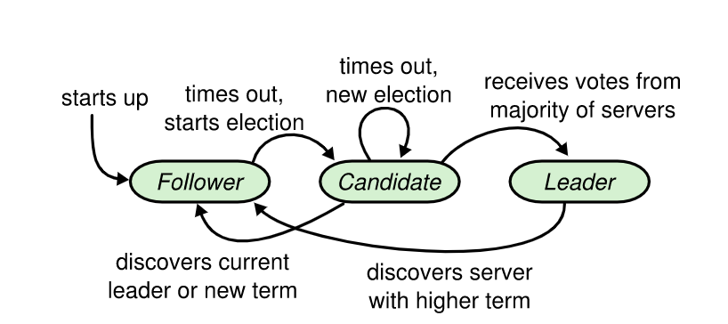
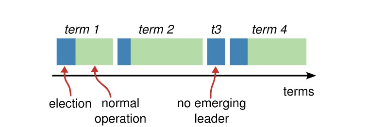
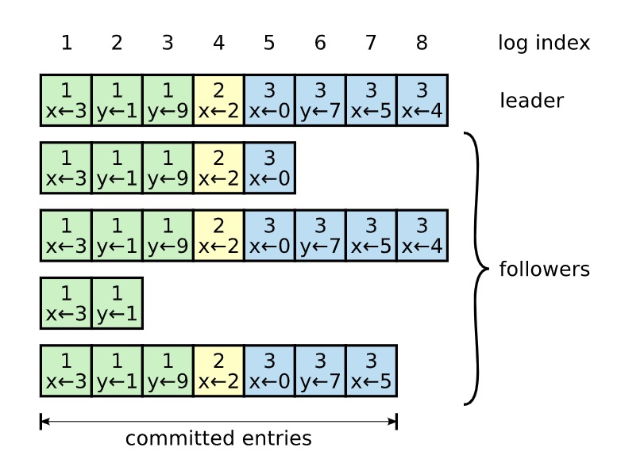
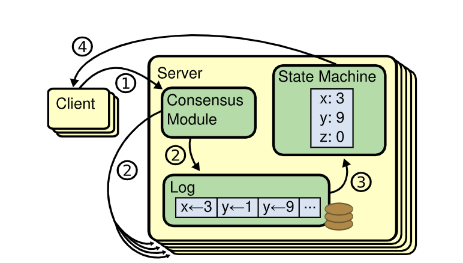
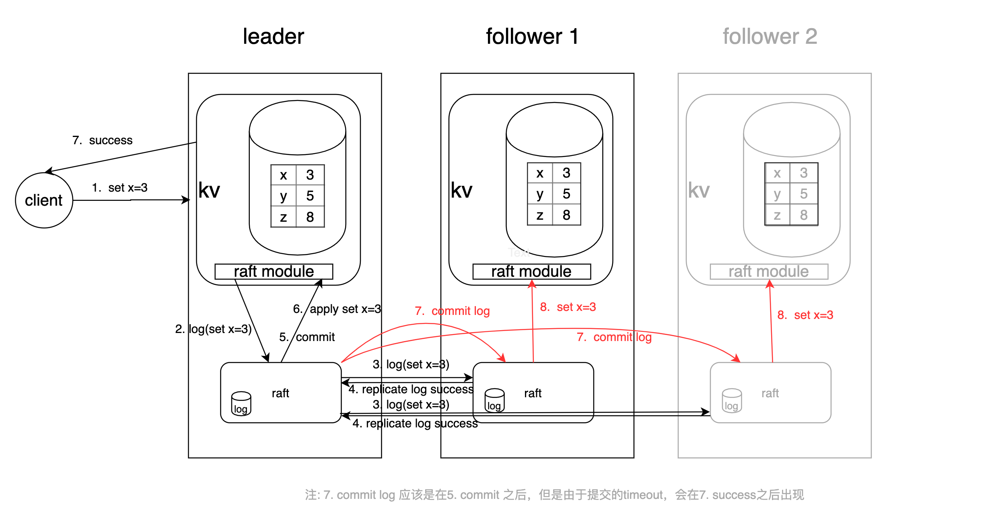

# go-raft

本仓库代码来源于：<https://github.com/santhosh-tekuri/raft>

## 相关链接

* <https://github.com/vision9527/raft-demo>
* 中英文论文地址：<https://github.com/maemual/raft-zh_cn>
* Raft系统运行可视化1 <http://thesecretlivesofdata.com/raft>
* Raft系统运行可视化2 <https://raft.github.io/#implementations>

## 目录

* [跑起来先](docs/跑起来先.md)
* [代码分析](docs/代码分析.md)

## Raft协议简介

* Raft 是一种为了管理复制日志的**强**一致性协议（类别：强一致性、弱一致性和最终一致性等）
* 复制状态机概念，复制状态机是指每个状态机或系统如果初始状态一致，然后接受的改变状态的命令也一致，最后产生的结果状态也是相同。

## Raft选举过程

选举过程图1（单个节点视角）

选举过程图2（整体视角）

## Raft日志复制流程

日志格式：term + index + cmd + type

请求处理整体流程

请求处理详细流程（重点）

注：这里7. commit log 应该是在5. commit之后，但是因为commit策略的原因有一定延迟，所以从日志上看是在回复客户端以后

---
